# ContactMe (SwiftUI Contacts App)

ContactMe is an app that lets the user create, edit, view, and delete contacts. 
The user creates a new contact with name, number, email, and profile picture.

The app is an example of a simple CRUD (Create, Read, Update, Delete) appliaiton.

The contacts are stored as a single JSON object in the app's document directory. Additionally, the contact images are saved with the contact's unique ID in the same directory.

Feel Free to Check Out the Code!

## ScreenShots

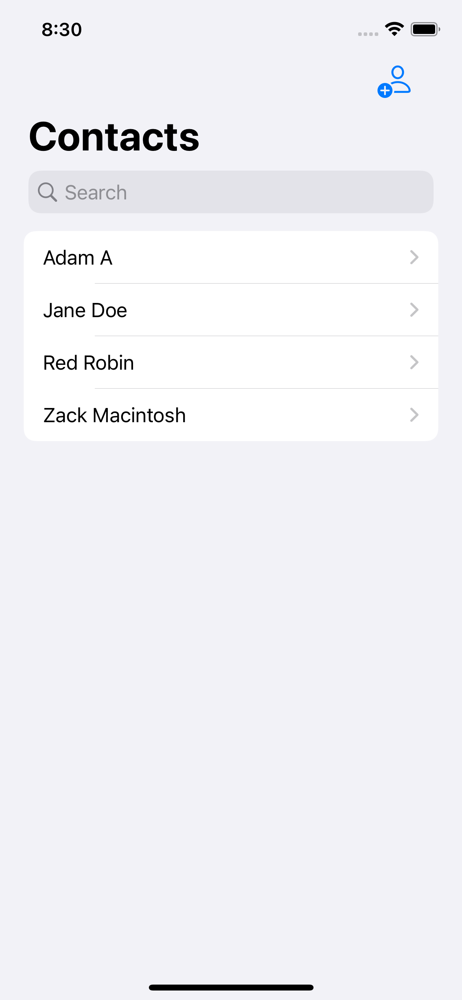
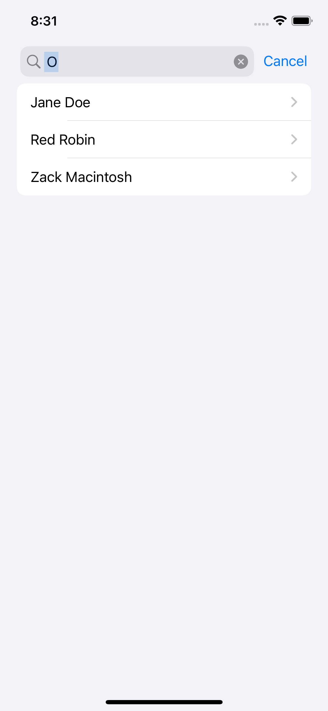

### Main Screen - Blank
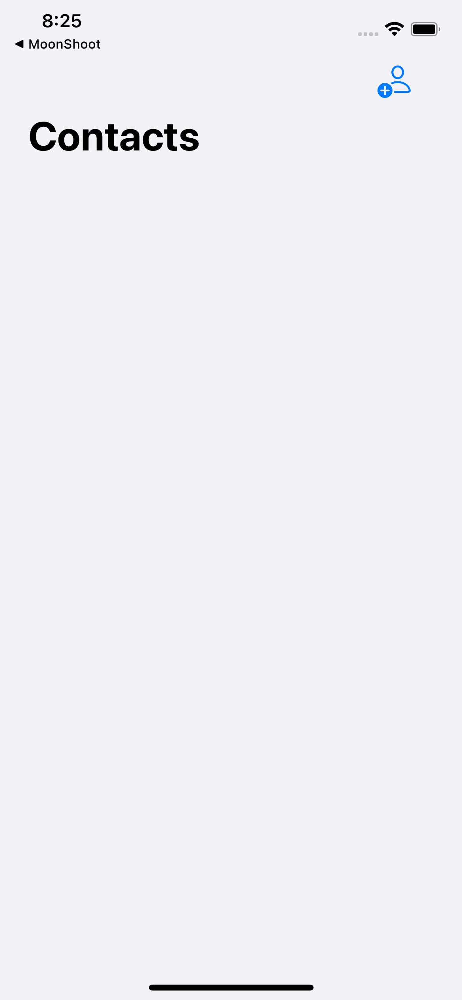

When the user first opens the app they are greated with a blank screen with an "Add Person" button.

### Adding a Contact
<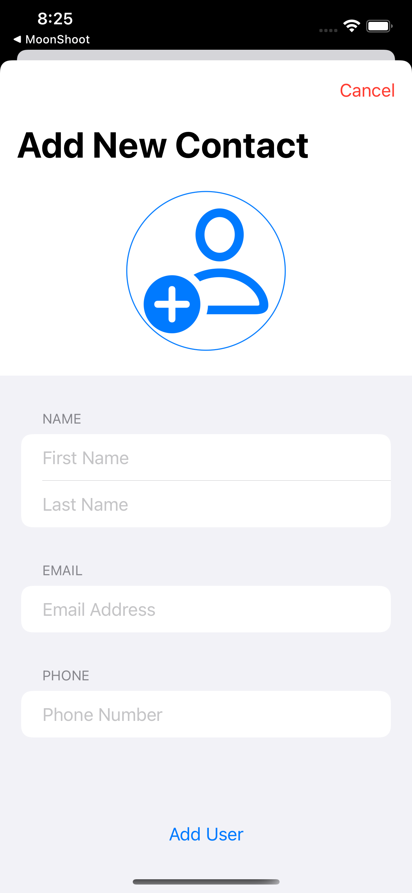

Clicking on the "Add Person" button brings up the add new contact sheet. The user can fill in the contacts' name, email, phone number, and a potential profile picture.

A filled out new contact may look like the following (without a contact image):

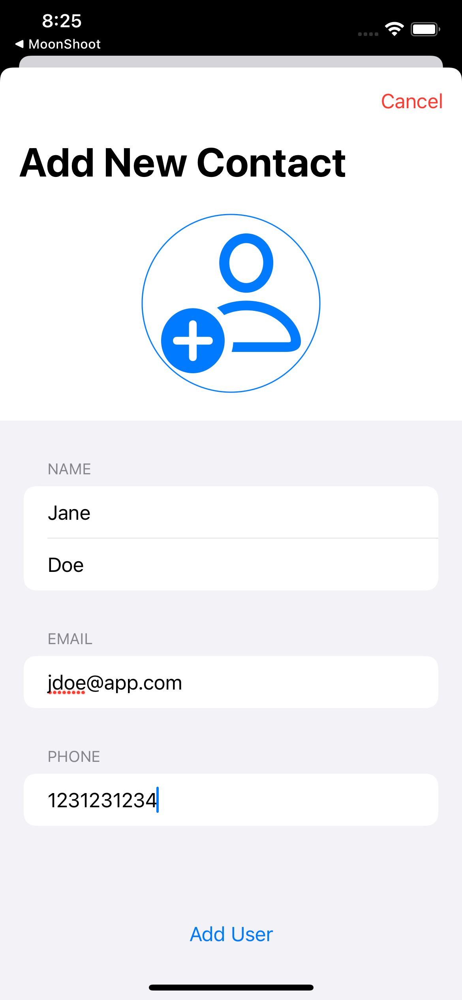

The user can click on the large "Person" icon and it will launch the image picker:

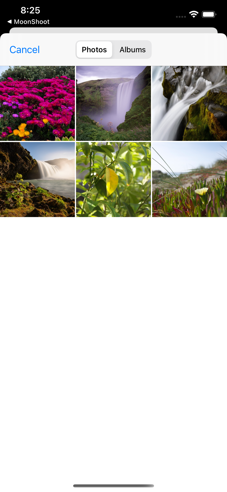

The user can select an image from their photo library (after granting permission) and the new contact sheet should look like the following.

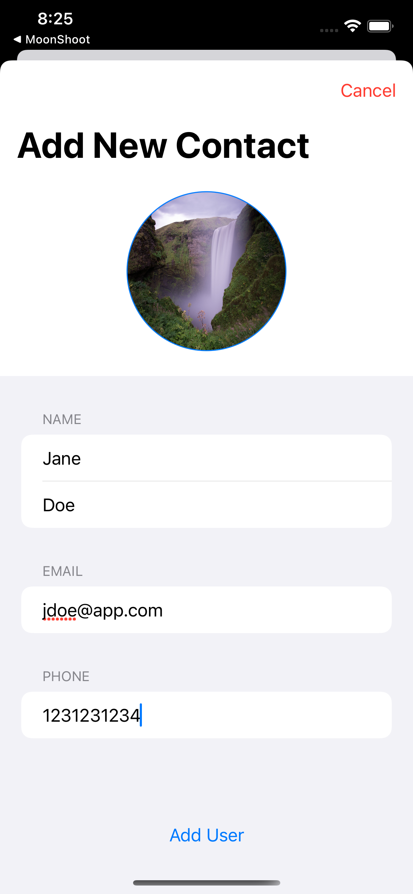

### Main Screen - With User(s)
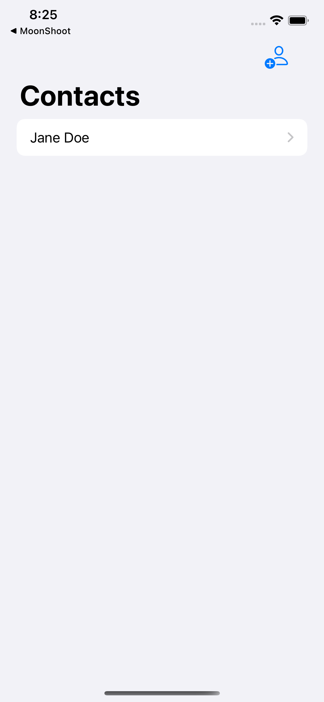

The main screen with a single contacts. 

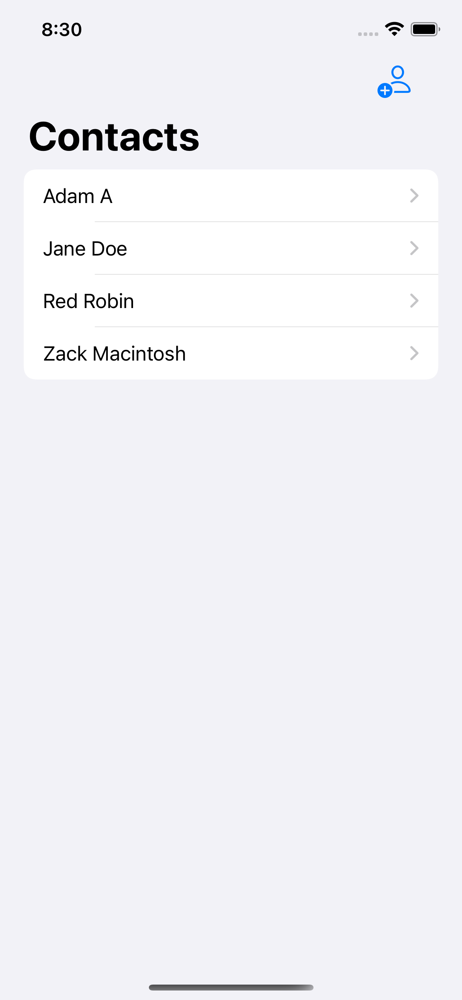

The main screen with multiple contacts.

### Viewing a Contact
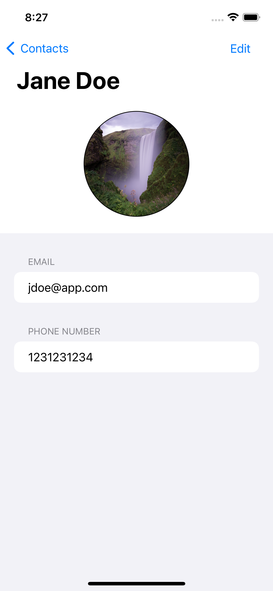

Clicking on a Contact will Bring up their page with the information that the user put in.

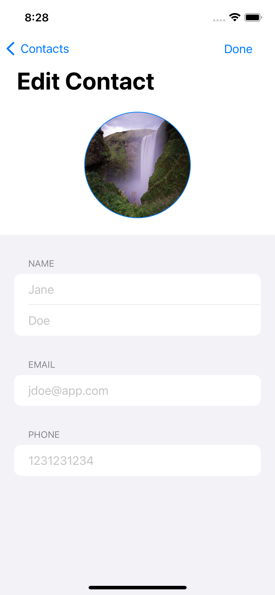

The user can click the "Edit" button and change any relevent information.

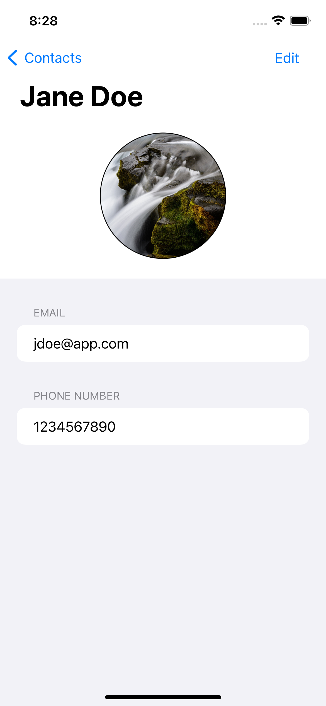

The information that the user updates changes and gets saved fro that contact.

### Deleting a Contact
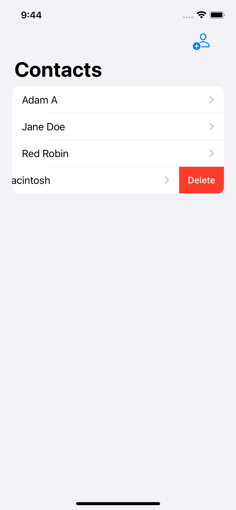

Swiping from left to right on an contact on the main screen will bring up the ability to delete a contact.

### Rolling For An Option

Pulling down from the top reveals the search function of the app. 

Users can then enter text that parses the contants first or last names to find any matches.
